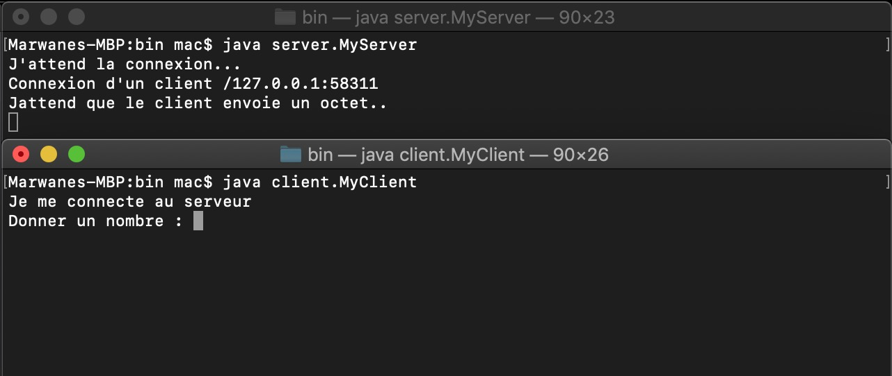
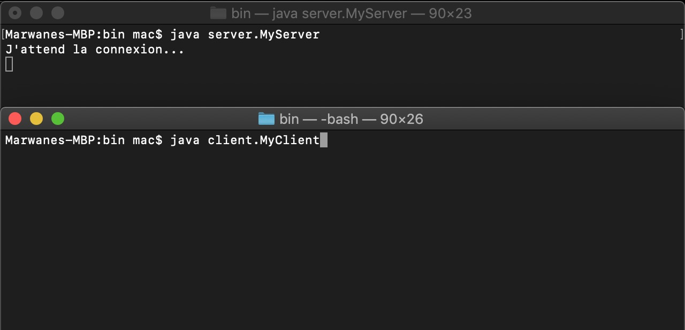
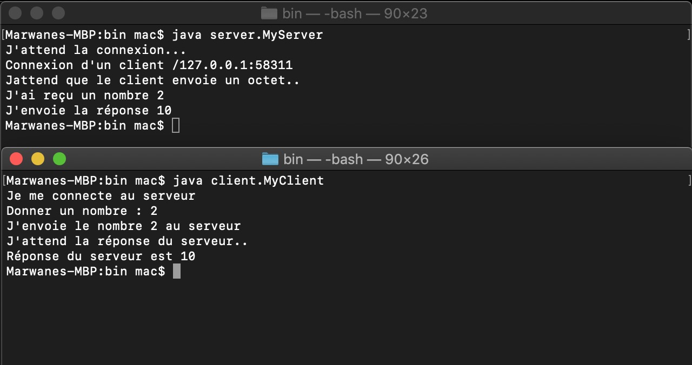
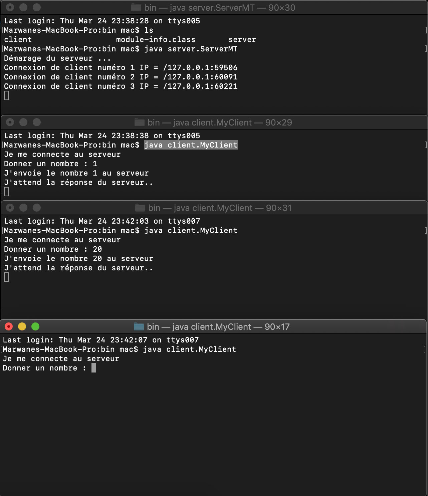

# Rapport

## Part 2

Dans cet partie, la réalisation la premiere application client/serveur qui fait les taches suivants:
- Lancer et etablir la connexion au serveur
- Lire un octet de l'apart de client
- Envoyer le resultat de la multiplication de nombre par 5 

## Part 4

Dans cet partie on a termine la deuxiéme application client/serveur qui fait les taches suivants:
- Etablir la connexion au serveur
- Accepter multi client au même temps

